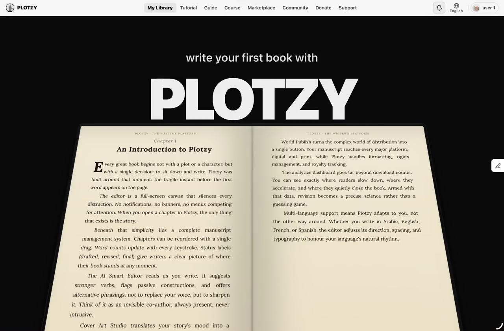
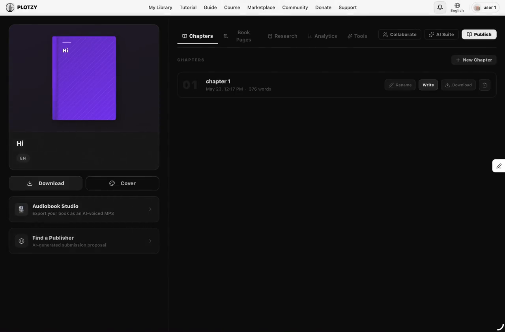
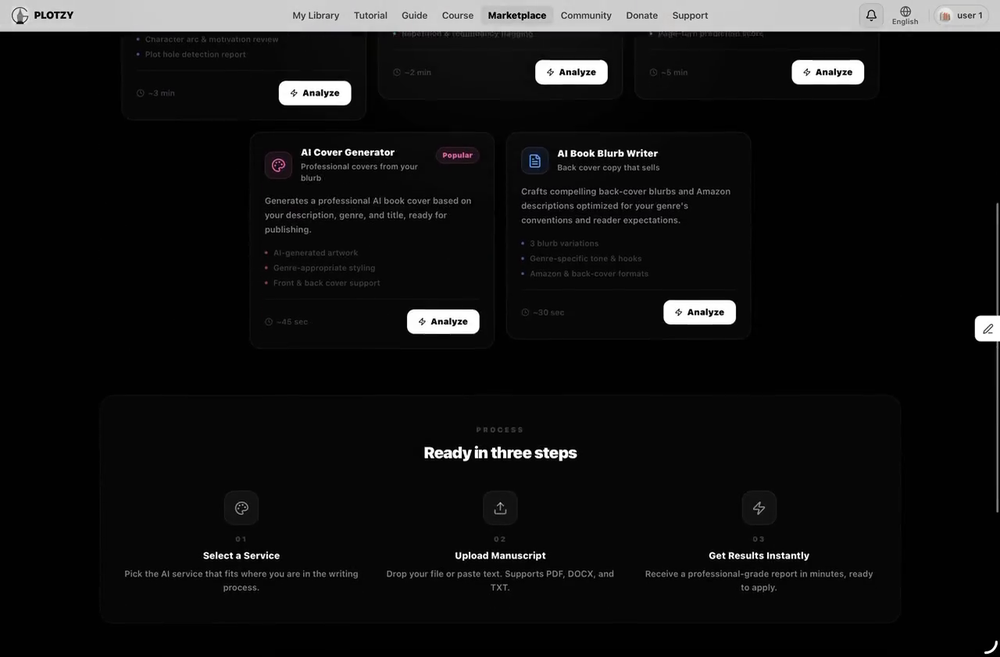
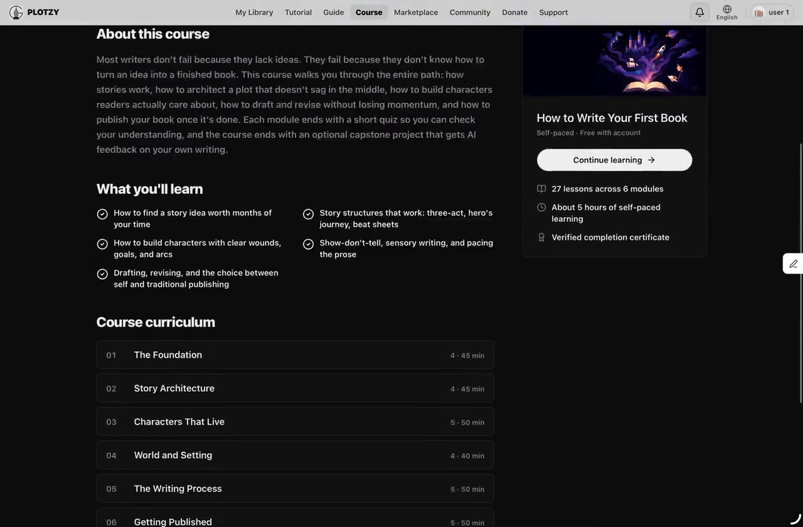
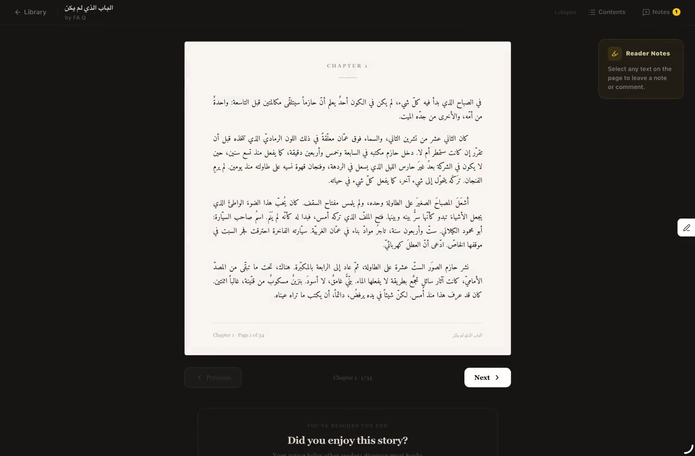
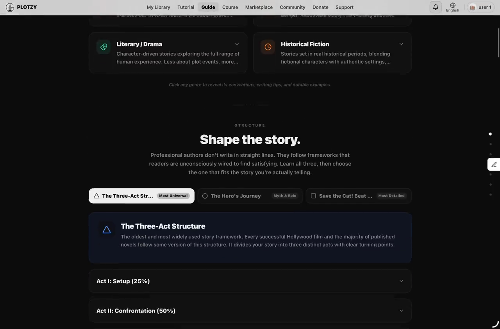
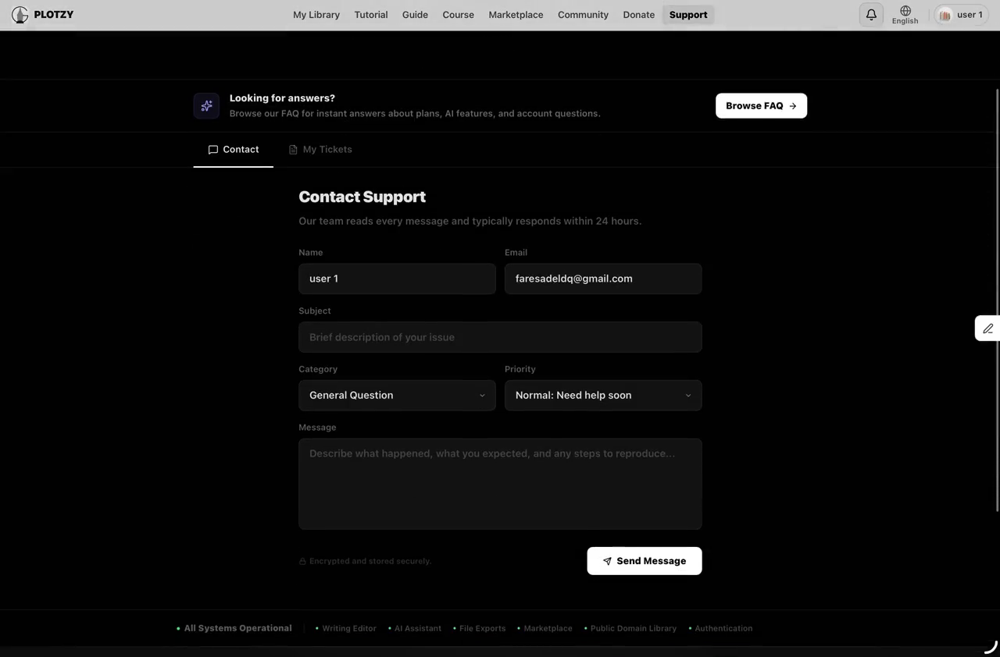

<div align="center">

# Plotzy

### A free bilingual writing platform built solo, from schema to production.

Chapter editor, AI assistant, audiobook narration, cover designer,
publishing marketplace, public library, writing course, social
graph, donation engine, and an admin panel. All in one place, no
paywall, no team, no shortcut.

[Live demo](https://plotzy.co) · [Case study](./CASE_STUDY.md) · [Tech stack](#technical-overview) · [Skills demonstrated](#skills-demonstrated) · [Hire me](#about-the-builder)



</div>

---

## What is Plotzy

Plotzy is a full writing platform for serious writers, designed
bilingually in Arabic and English from the first commit. It started as
the graduation project at the Hashemite University in Jordan and grew
into a production system covering everything a writer needs to take a
book from idea to publication. One developer wrote every line of the
schema, the backend, the frontend, the deployment scripts, the AI
prompts, the course content, and the documentation you are reading now.

The repository is open source so the engineering decisions, the code
quality, the bilingual depth, and the scale of what one person can
ship are all directly inspectable.

---

## Complete feature catalogue

### Writing surface (chapter editor and book dashboard)

- TipTap based rich text editor with full keyboard shortcuts
- Autosave on every keystroke with offline recovery
- Drag to reorder chapters with type-confirm delete
- Inline rename of chapter titles
- Story bible (lore entries) for characters, locations, items, magic systems
- AI-powered story bible auto extraction from manuscript text
- Multiple paper size presets (A5, Pocket, Trade, A4)
- Custom margins, font size, font family per book
- Word count, reading time estimate, daily writing progress tracker
- Built-from-scratch DOM measurement based pagination engine
- Print preview that mirrors layout to right-to-left for Arabic
- Five tabs per book: Chapters, Book Pages, Research, Analytics, Tools
- Front matter, back matter, custom title page composition
- Book description editor
- Version history per chapter with restore
- Collaboration via join codes (real-time multi-writer editing)
- Five-tab book dashboard with sidebar shortcuts to every major action

### AI writing assistant

- Polish (improve text)
- Expand (lengthen a passage)
- Continue (extend at the cursor)
- Translate (between 8 languages)
- Story plotting helper
- Character dialogue helper
- Revision and rewriting feedback
- Auto-detects the writer's language and replies in it
- Streaming responses for instant feedback
- Token usage logged per user for daily limits
- Output post-processor strips echoed prompts and hallucinated prefixes
- Fenced input (`<<<` `>>>`) to prevent the model from continuing the prompt

### Audiobook studio

- Five AI voices total: Ryan, Sophie, Jenny, James (English), Kareem (Arabic)
- Self hosted Piper TTS (no per-minute API cost)
- Voice models downloaded at Docker build time, cached in image layer
- Per-chapter preview generation
- Full book export to a single MP3
- Long-text chunker that splits at sentence boundaries near 6000 chars
- ffmpeg concat demuxer for multi-chapter audio (not Buffer.concat)
- Adjustable narration speed (0.5x to 2x via length_scale)
- Signal-aware error reporting (SIGKILL, SIGSEGV detection)
- Voice file existence check at synthesis start to fail fast
- Background job ready architecture for long exports

### Cover designer

- AI-generated cover from title + genre + mood prompt
- Manual composition from stock art
- Multiple cover templates
- Cover preview at multiple sizes (thumb, list, detail, print)
- Cover migration script for legacy base64 storage to file system

### AI marketplace (5 services)

- Developmental editor (story structure, pacing, character arcs, plot holes)
- Copy editor (grammar, punctuation, style consistency, fix list)
- Beta reader simulation (5 reader personas, honest feedback)
- Cover generator (AI design from manuscript)
- Blurb writer (3 lengths: short, back cover, Amazon description)
- 8 prompt definitions on the backend (covers proofreader, query letter, social kit, sensitivity reader as additional services)
- Three input modes: file upload, paste text, pick from your library
- Markdown formatted reports with score breakdowns
- Manuscript window: 8000 chars input, 1500 max output tokens
- Two-attempt fallback strategy on rate-limit errors
- Language detection per manuscript so Arabic input gets an Arabic report
- Monthly per-user quota with reset on the first of every month

### Find a publisher

- AI generated submission proposal tailored to the manuscript
- Hook paragraph, synopsis, comp titles, author bio
- Editable proposal before sending
- Output formatted for direct send to literary agents

### Community library

- Browse all community-published books
- Search by title, author, or full text
- Filter by 15 genres (Fantasy, Sci-Fi, Mystery, Romance, Historical, etc.)
- Sort by most recent, most read, most liked
- Star rating system (1-5 stars per book)
- Like and unlike books
- Follow and unfollow writers
- Author profile pages with follower count, books written, total likes
- Comment system with threading per chapter
- Notification system (in-app dropdown plus email)
- Mark all read for notifications and messages
- Direct messaging between users
- Activity feed for new chapters from followed writers
- Book details page with publish/unpublish toggle

### Public domain library (Discover)

- Project Gutenberg integration (70,000+ English classics)
- Hindawi Foundation integration (tens of thousands of Arabic classics)
- Toggle between sources
- 16-topic filtering (Fiction, Mystery, Adventure, Philosophy, etc.)
- Language filtering on Project Gutenberg
- Sort by most popular or recently added
- Recently Read shelf with resume-from-page progress tracking
- In-browser PDF.js reader for any book
- Pagination across thousands of results
- Hindawi precache strategy (boot-time validation)

### Writing course

- 6 modules covering foundations, planning, drafting, revision, publishing, post-publishing
- 27 lessons with text content and embedded examples
- 6 module quizzes with multiple-choice questions and immediate feedback
- Final project submission with checkpoint guidance
- Progress tracking per user
- Resume from last incomplete lesson
- Verified certificate of completion with unique verification code
- Certificate PDF generation with Puppeteer
- Certificate verification page (anyone can verify a code)
- Course content bundled in source (survives DB migrations)
- Hero images for each module
- Free for every signed-in user (course landing page allows browsing without signup)

### Writing guide

- 15 genres covered in depth (each with tactics and pitfalls)
- 3 story structure frameworks (Hero's Journey, Save the Cat, Three Act)
- 6 character pillars and 3 classic arc types
- Dialogue principles with worked Arabic and English examples
- 4-phase writing process workflow with checkable items
- Self-edit checklist (line-by-line review framework)
- Common first-draft mistakes with rewrites
- Full guide downloadable as PDF

### Multi-format export

- PDF with Cairo font (modern Arabic)
- PDF with Amiri font (literary Arabic)
- Word docx export with proper styles
- EPUB export (epub-gen)
- Plain TXT export
- Per-chapter download for any format
- Server-side rendering via Puppeteer + Chromium

### Tutorial page

- Featured video at the top
- Photo guides grid (currently 8 guides)
- Each guide: video, bilingual title, description, "What you can do" feature bullets
- Category filter (only populated categories shown)
- Modal with vertical scroll, side-by-side video and features on desktop
- Silent autoplay video walkthroughs
- All content bundled in source code

### Account and settings

- Profile editor (display name, bio, avatar, social links)
- Password change (where supported)
- Language preference (8 languages)
- Theme preference
- Email notification preferences
- Data export (download all your books in any format)
- Account deletion flow
- Privacy policy and Terms of Service pages
- Donation history view

### Support and FAQ

- Ticketed support with category and priority
- Status tracking (open, in progress, resolved)
- Thread view with replies
- 8-category FAQ with deep-link anchors
- System status indicator (operational / partial outage)
- Live updates from operator

### Donation flow

- PayPal Smart Buttons SDK with Radio Fields pattern
- 6 preset amounts plus custom field ($5 to $250+)
- Receipt email via PayPal
- Donation idempotency keys
- Donation tracking in admin panel
- Thank-you page
- No subscription, no recurring billing, no perks

### Admin panel

- Total stats overview (users, books, chapters, support tickets)
- User management (search, suspend, restore, grant subscription, revoke)
- Activity feed (signups, publishes, payments, support)
- Revenue tab (MRR, conversion rate, churn, recent payments)
- Donations tab (lifetime total, monthly total, unique donors, list)
- Moderation tab (flag books, approve, reject and unpublish)
- Engagement tab (leaderboard, inactive users, AI usage)
- Support inbox (read/reply to tickets)
- Charts rendered with Recharts (BarChart, LineChart, PieChart, AreaChart)

### Authentication

- Google OAuth 2.0
- Apple Sign-In
- Session-based auth with Postgres-backed session store (`connect-pg-simple`)
- Cookie security (HttpOnly, Secure, SameSite)
- iPad-specific OAuth 404 fix (service worker denylist)
- Owner-only middleware for book endpoints
- Admin bypass middleware (admins can manage any user's book)
- Email verification flow
- Account suspension support

---

## Screenshots

<table>
  <tr>
    <td width="50%">
      <strong>Your book page</strong><br/>
      <em>Five tabs, drag to reorder, multi format export, audiobook studio shortcut, find a publisher, publish to the community.</em><br/>
      
    </td>
    <td width="50%">
      <strong>AI marketplace</strong><br/>
      <em>Five professional analyses on your manuscript. Upload, paste, or pick from your own books.</em><br/>
      
    </td>
  </tr>
  <tr>
    <td width="50%">
      <strong>Writing course</strong><br/>
      <em>Six modules, twenty seven lessons, quizzes, a verified certificate. Free.</em><br/>
      
    </td>
    <td width="50%">
      <strong>Community library</strong><br/>
      <em>Publish to the public library, follow writers, like and rate books, plus 70K+ public domain classics.</em><br/>
      
    </td>
  </tr>
  <tr>
    <td width="50%">
      <strong>Writing guide</strong><br/>
      <em>Bilingual craft reference for fifteen genres, three structure frameworks, character pillars, and a self editing checklist.</em><br/>
      
    </td>
    <td width="50%">
      <strong>Support and FAQ</strong><br/>
      <em>Ticketed support with category and priority, plus eight category FAQ with deep links.</em><br/>
      
    </td>
  </tr>
</table>

---

## By the numbers

<div align="center">

| | |
|---:|:---|
| **~100,000** | lines of TypeScript across frontend, backend, shared libs |
| **43** | distinct pages (writing, social, admin, learning, settings) |
| **150** | reusable React components |
| **257** | REST API endpoints |
| **30+** | Postgres tables with relations, indexes, and constraints |
| **8** | UI languages with full right to left support for Arabic and Hebrew |
| **5** | self hosted AI voices for audiobook narration |
| **5** | AI marketplace services live |
| **8** | total marketplace prompts on the backend |
| **6** | course modules with quizzes and a verified certificate |
| **27** | lessons in the writing course |
| **15** | story genres covered in the writing guide |
| **3** | story structure frameworks |
| **5** | export formats (PDF Cairo, PDF Amiri, Word, EPUB, TXT) |
| **2** | public-domain book providers integrated (Project Gutenberg + Hindawi) |
| **70,000+** | public-domain books inside the app |
| **1** | developer |

</div>

---

## Skills demonstrated

This repository is a complete proof of the following skill set. Every
item listed here is a concrete piece of the codebase, not a buzzword.

### Frontend engineering

- **React 18** with **TypeScript** in strict mode end-to-end
- **Tailwind CSS** with a hand-built design system (no UI library)
- **Vite** build pipeline with hot module replacement under 200ms
- **TipTap** (ProseMirror) as the rich text editor
- **Wouter** for client-side routing (43 routes)
- **TanStack Query** for server state, caching, optimistic updates
- **PayPal Smart Buttons SDK** with Radio Fields donation pattern
- **PDF.js** for in-browser reading of public-domain books
- **Workbox** service worker with `navigateFallbackDenylist` for OAuth
- **react-i18next** with 8 languages and full RTL
- **Recharts** for the admin analytics dashboard (Bar, Line, Pie, Area)
- Custom **DOM measurement pagination engine** (no third-party paginator)
- Custom **drag-and-drop** for chapter reordering (no react-dnd)
- Custom **modal**, **toast**, **error boundary** systems
- Custom **theme provider**, **auth context**, **language context**
- Responsive across phone, tablet, iPad, desktop
- Accessibility primitives (aria labels, focus traps, keyboard nav)
- Lazy loading, code splitting, image optimisation
- PWA install prompt and offline fallback

### Backend engineering

- **Express** with **TypeScript** for the API layer
- **Drizzle ORM** with type-safe queries against Postgres
- **PostgreSQL** schema with 30+ tables, foreign keys, cascade deletes,
  unique indexes for idempotency, composite indexes for hot queries
- **connect-pg-simple** for Postgres-backed sessions
- **Passport.js** with **Google OAuth** and **Apple OAuth**
- **Multer** for multipart file uploads with size limits
- **express-rate-limit** with per-IP, per-user, per-route policies
- **Zod** schemas in `lib/api-zod` shared between frontend and backend
- **Resend** for transactional email
- **Sentry** for production error monitoring
- 257 REST endpoints across writing, social, AI, payments, admin
- Custom middleware: `requireAuth`, `requireBookOwner`, `requireAdmin`,
  `requireOpenAI`, `tierAiLimiter`, `aiLimiter`, `paymentLimiter`,
  `audioBodyParser`, `largeBodyParser`
- Body-size guards (15 MB default, larger for audio)
- Session migration handled cleanly across DB providers

### AI integration

- **OpenAI SDK** pointed at **Groq** (Llama 3.3 70B) for cost
- 10+ distinct AI features (assistant, marketplace, blurb, cover prompts,
  proposal generation, story bible auto-extract, translation, polish,
  expand, continue, audiobook chunking)
- **Prompt engineering** in Arabic and English (fence markers, language
  auto-detect, output post-processor)
- **Two-attempt fallback** strategy with reduced token budgets
- **Centralized error handler** (`handleAiError`) that unpacks the
  OpenAI SDK error shape (status, code, type, provider message)
- **Per-user daily AI usage tracking** with quota enforcement
- **Streaming responses** for instant token feedback
- **Mock provider mode** for local development without a key
- **Provider-agnostic base URL** (OpenAI, Groq, local LLM all supported)

### Audio engineering

- **Piper TTS** integration via Python child process
- 5 voice models (60-100 MB each) downloaded at Docker build time
- **WAV synthesis** then **ffmpeg WAV-to-MP3** in one pipeline
- **Sentence-aware chunker** for long-form text (6000-char target)
- **ffmpeg concat demuxer** for multi-chapter MP3 assembly
  (`Buffer.concat` produced broken MP3s, fixed)
- **Signal-aware error reporting** (SIGKILL detection for OOM, SIGSEGV
  for native crashes)
- **Voice file existence checks** at synthesis start to fail loudly
- **Length scale calculation** for adjustable narration speed
- **File-based temp I/O** because Piper's stdin/stdout streaming was unreliable

### File processing

- **Puppeteer + Chromium** for PDF generation (book export)
- **Cairo font** for Arabic PDF
- **Amiri font** for literary Arabic PDF
- **docx** library for Word export with style preservation
- **epub-gen** for EPUB export
- Plain TXT export with proper Arabic encoding
- **HTML stripper** for TTS input (TipTap output is HTML, Piper needs plain)
- **Course content JSON** bundled in source as the source of truth
- **Cover migration script** for legacy base64 to file system

### Database design

- **30+ tables** with relations and indexes
- **`users`, `books`, `chapters`, `lore_entries`, `chapter_snapshots`**
  for writing
- **`book_likes`, `follows`, `comments`, `ratings`, `direct_messages`,
  `notifications`** for social
- **`course_modules`, `course_lessons`, `course_quizzes`,
  `course_questions`, `course_progress`, `certificates`** for learning
- **`subscription_payments`, `donations`, `marketplace_usage`,
  `audiobook_exports`, `daily_ai_usage`** for monetisation and AI
- **`support_messages`, `content_flags`, `audit_logs`, `api_logs`,
  `page_views`, `user_stats`** for ops
- **Unique indexes** for ON CONFLICT idempotency
- **Composite indexes** for query performance on hot paths
- **Cascade deletes** to keep referential integrity
- **`user_sessions`** Postgres-backed session storage

### DevOps and infrastructure

- **Vercel** deployment for the frontend (PWA on the edge)
- **Railway** deployment for the backend with a custom multi-stage **Dockerfile**
- **Docker** image with Express, Python, ffmpeg, Chromium, and voice models
- **Supabase** for managed Postgres with PITR backups
- **pnpm workspaces** monorepo with shared `lib/` packages
- **Environment variable** management across local, dev, prod
- Vercel **rewrites** for `/auth/*` and `/api/*` to proxy to Railway
- **CI-friendly**: GitHub push triggers automatic Vercel and Railway builds
- **Database migrations** (Drizzle Kit) with manual SQL fallback for TTY issues
- **Custom deployment docs** in `DEPLOYMENT.md`
- **Mid-project DB migration** from Neon to Supabase (3 hours)
- **Mid-project AI provider migration** from OpenAI to Groq (20 minutes)
- **Mid-project TTS migration** from Microsoft Edge TTS to Piper

### Security

- **Session cookies** with HttpOnly, Secure, SameSite
- **CSRF protection** via SameSite cookies
- **Rate limiting** at three layers (general, AI, payments)
- **OAuth state verification** to prevent CSRF on login
- **Owner-only endpoint protection** via `requireBookOwner` middleware
- **PayPal payment verification** (amount + currency check before activation)
- **Forensic logging** on payment mismatches (Sentry alert with extras)
- **Admin bypass middleware** scoped strictly to admin operations
- **`AbortController` and timeouts** on outbound HTTP for hung providers
- **Idempotency keys** on payment captures, donations, AI usage records
- **Email verification** before allowing certain actions
- **SQL injection protection** via Drizzle parameterised queries
- **No raw user input** in file paths or shell commands

### Internationalisation

- **8 UI languages**: English, Arabic, Russian, Chinese, Japanese,
  Korean, Hebrew, Persian
- **Full right-to-left support** for Arabic and Hebrew including the
  editor, the PDF export, the audiobook voice selection, the AI prompts
- **Arabic typography** (Cairo for modern, Amiri for literary)
- **Language auto-detection** from manuscript content
- **AI assistant replies in the writer's language**
- **Bilingual error messages** end-to-end
- **Public-domain Arabic library** (Hindawi Foundation, tens of thousands of books)
- **Bilingual course content** with Arabic and English variants per lesson

### Payment processing

- **PayPal Smart Buttons SDK** with Radio Fields pattern
- **PayPal Orders API** integration (create, capture)
- **Idempotency** on the capture flow (handles ORDER_ALREADY_CAPTURED)
- **Amount and currency verification** post-capture before activation
- **Sentry forensic logging** on mismatch (possible tampering)
- **Donation flow** distinct from subscription flow
- **Receipt emails** dispatched fire-and-forget after capture
- **Cancellation flow** with audit logging and grace-period entitlement
- **MyFatoorah research** for Apple Pay support in Jordan (pending vendor approval)

### Email system

- **Resend SDK** for transactional sending
- **Bilingual HTML templates** for receipt, cancellation, welcome
- **Fire-and-forget dispatch** so a slow email never blocks an API response
- **Idempotent sending** for receipts (one per payment)
- **Engagement notifications** for new followers, likes, comments
- **Expiry reminder cron** for legacy subscription period endings

### SEO and web standards

- **Meta tags** per page (title, description, OG, canonical)
- **JSON-LD structured data** (BreadcrumbList, Article)
- **robots.txt** and **sitemap.xml**
- **PWA manifest** with proper icons and theme color
- **Service worker** for offline support
- **Image optimisation** (responsive sizes, lazy loading)

### Engineering practices

- **TypeScript strict mode** across the entire monorepo
- **Schema as source of truth** (Drizzle, imported by both frontend and backend)
- **Conventional commit messages** with full context in the body
- **No emojis, no em-dashes** rule for user-facing copy (consistent voice)
- **Code review of self** through detailed commit messages and case study
- **Documentation as a first-class concern** (README, CASE_STUDY,
  DEPLOYMENT, in-code comments explaining the why)
- **Refactor when the shape is wrong** (Neon to Supabase, Edge TTS to
  Piper, tiered SaaS to donation, OpenAI to Groq)
- **Production-first mindset** (Plotzy has run in production since
  early in development, every change is shipped, not staged)

---

## Architecture diagram

```
                    ┌────────────────────────────────┐
                    │       Browsers and Apps        │
                    │   (PWA on phone, iPad, web)    │
                    └────────────────┬───────────────┘
                                     │ HTTPS
                                     ▼
                    ┌────────────────────────────────┐
                    │      Vercel (Edge CDN)         │
                    │  React + Vite + Tailwind PWA   │
                    │  Static assets, tutorial mp4s  │
                    └────────────────┬───────────────┘
                                     │ /api/*, /auth/*  proxy
                                     ▼
                    ┌────────────────────────────────┐
                    │   Railway (Docker container)   │
                    │  ┌──────────────────────────┐  │
                    │  │ Express + TypeScript     │  │
                    │  │ + Drizzle ORM            │  │
                    │  │ + Passport (OAuth)       │  │
                    │  │ + connect-pg-simple      │  │
                    │  └─────┬──────────────┬─────┘  │
                    │        │              │        │
                    │  ┌─────▼────┐    ┌────▼─────┐ │
                    │  │ Python   │    │ ffmpeg   │ │
                    │  │ Piper    │    │ WAV→MP3  │ │
                    │  │ TTS      │    │ concat   │ │
                    │  └──────────┘    └──────────┘ │
                    └────────────────┬───────────────┘
                                     │
              ┌──────────────────────┼──────────────────────┐
              │                      │                      │
              ▼                      ▼                      ▼
    ┌─────────────────┐    ┌────────────────┐    ┌──────────────────┐
    │ Supabase        │    │ Groq           │    │ PayPal           │
    │ Postgres        │    │ Llama 3.3 70B  │    │ Smart Buttons    │
    │ (30+ tables,    │    │ (text AI)      │    │ + Orders API     │
    │  sessions, PITR)│    │                │    │                  │
    └─────────────────┘    └────────────────┘    └──────────────────┘
              │                                            │
              │                                            │
              │              ┌────────────────┐            │
              └──────────────│ Resend         │────────────┘
                             │ (email)        │
                             └────────────────┘
```

---

## Repository layout

Monorepo using **pnpm workspaces**:

```
plotzy/
│
├── artifacts/
│   ├── plotzy/                  # React + Vite frontend
│   │   ├── src/
│   │   │   ├── pages/           # 43 pages
│   │   │   ├── components/      # 150+ reusable components
│   │   │   ├── contexts/        # auth, language, theme
│   │   │   ├── data/            # tutorial guides (bundled in code)
│   │   │   ├── lib/             # i18n, schema helpers, utils
│   │   │   └── hooks/           # useBooks, useAuth, useToast, etc.
│   │   ├── public/
│   │   │   ├── tutorials/       # 8 silent walkthrough mp4s
│   │   │   └── ...              # icons, fonts, manifest, sitemap
│   │   └── vite.config.ts       # PWA + Workbox config
│   │
│   └── api-server/              # Express + Drizzle backend
│       ├── src/
│       │   ├── routes.ts        # 257 REST endpoints (live)
│       │   ├── routes/          # extracted sub-route files
│       │   ├── middleware/      # auth, rate-limit, page-view tracker
│       │   ├── lib/
│       │   │   ├── piper-tts.ts # Piper child process + chunker + ffmpeg
│       │   │   ├── ai-error.ts  # centralised AI error unpacker
│       │   │   ├── tier-limits.ts
│       │   │   ├── email.ts     # Resend templates
│       │   │   └── ...
│       │   ├── auth.ts          # Passport, OAuth flows
│       │   ├── storage.ts       # data access layer
│       │   ├── db.ts            # pg pool + Drizzle init
│       │   └── app.ts           # Express app composition
│       ├── voices/              # Piper voice models (downloaded at build)
│       └── healthcheck.mjs
│
├── lib/
│   ├── db/
│   │   ├── src/
│   │   │   ├── schema/index.ts  # source of truth, ~1400 lines
│   │   │   └── course-content/  # bundled course content
│   │   └── drizzle.config.ts
│   ├── api-zod/                 # Zod schemas shared frontend/backend
│   └── shared/                  # utilities, types, constants
│
├── scripts/                     # one-off migrations and imports
├── docs/screenshots/            # README assets
├── Dockerfile                   # Railway build (multi-stage)
├── pnpm-workspace.yaml
├── README.md                    # this file
├── CASE_STUDY.md                # the deeper engineering story
└── DEPLOYMENT.md                # production setup notes
```

---

## Engineering highlights

A handful of decisions worth calling out from the build:

### Bilingual from the first line of code

Arabic right to left is not a translation layer over an English app.
The editor's pagination engine, the PDF export typography, the AI
assistant's prompts, the audiobook voice selection, the public-domain
library (Hindawi for Arabic, Project Gutenberg for English), and every
i18n string are all aware of the writer's language at every level of
the stack. Arabic books export with the Cairo or Amiri font
automatically. The AI assistant detects the writing language and replies
in it, no flag needed.

### A monolithic AI gateway

Every AI feature (assistant, marketplace, blurb, cover prompts,
proposal, story bible extraction, audiobook chunker) hits the same
provider abstraction so swapping models is a one-line change. When the
project migrated from OpenAI direct to Groq to cut spend by 90%, the
move took twenty minutes.

### Self-hosted audiobook narration

The audiobook studio uses Piper TTS running locally in the container,
not a paid API. Each voice model is downloaded at image build time. The
result is unlimited narration with no per-minute cost, in English and
Arabic equally. The pipeline chunks long text at sentence boundaries,
synthesises each chunk in parallel, encodes to MP3, then concatenates
with ffmpeg's concat demuxer (not `Buffer.concat`, which produced
unplayable Frankenstein MP3s).

### A custom RTL-aware pagination engine

The chapter editor's print preview uses a DOM measurement based
paginator. It mounts a hidden host div with the same CSS as a real page,
fills it with the next slice of text, measures `scrollHeight`, and
binary-searches for the break point. When the writer switches languages,
the engine mirrors page order, headers, footers, padding, and page
numbers automatically. The PDF export uses Puppeteer with the same CSS
so the on-screen and on-paper layouts match exactly.

### Real freemium with no paywall

Plotzy started as a tiered SaaS (Free, Pro at $4.99, Premium at $8.99)
and pivoted to a donation-funded model. The user, capability, and limit
tables are still in place so a future operator can flip back to tiered
pricing in minutes by changing booleans in
`lib/db/src/schema/index.ts` and `tier-limits.ts`.

### Production observability without dashboards

Every AI route logs through a single `handleAiError` helper that
unpacks OpenAI SDK error shapes (status, code, type, provider message)
and surfaces the real reason to admin users in the UI, so debugging
production issues does not require Railway log access. Plotzy uses
Sentry for general errors but the AI-specific path is intentionally
self-debuggable from the browser.

### Idempotent everything

Payment captures, donation captures, marketplace usage recording, and
AI usage incrementing all use `ON CONFLICT DO NOTHING` against unique
indexes. A double-click on the donate button, a network retry, or a
PayPal webhook replay produces the same database state as a single
clean call.

---

## Quick start (local dev)

```bash
pnpm install
cp .env.example .env       # fill in DATABASE_URL + AI keys
pnpm --filter @workspace/api-server dev     # backend on :8080
pnpm --filter @workspace/plotzy dev          # frontend on :5173
```

The frontend proxies `/api/*` to the backend, so a single browser tab
on `localhost:5173` is the full development experience.

Full deployment notes (Vercel + Railway + Supabase) are in
[`DEPLOYMENT.md`](./DEPLOYMENT.md).

---

## Read more

- [`CASE_STUDY.md`](./CASE_STUDY.md) for the deeper engineering story:
  challenges, decisions, and the things that broke.
- [`DEPLOYMENT.md`](./DEPLOYMENT.md) for the production setup.
- [`artifacts/plotzy/src/data/tutorial-guides.ts`](./artifacts/plotzy/src/data/tutorial-guides.ts)
  for a bilingual walkthrough of every section.
- [`lib/db/src/schema/index.ts`](./lib/db/src/schema/index.ts) for the
  full database schema in one file.

---

## About the builder

**Fares Hamdan.** Final year Computer Science student at the Hashemite
University, Jordan. Built Plotzy alone as the graduation project, from
the database schema up to the production deployment, the AI prompts,
the course content, and the documentation you are reading.

What this project proves I can do, hands on:

- **Take a product from zero to production, alone, end-to-end.** Schema,
  backend, frontend, AI, audio, DevOps, design, copy, docs, support.
- **Make technical decisions for business reasons, not for novelty.**
  Vite over Next, REST over GraphQL, Groq over OpenAI, Piper over
  ElevenLabs, Express over a framework, every choice has a documented
  rationale in the case study.
- **Migrate hard things in production without downtime.** Neon to
  Supabase, OpenAI to Groq, Edge TTS to Piper, tiered SaaS to donation.
- **Treat Arabic as a first class concern, not a translation layer.**
  Right to left support down to the typography and the AI prompt.
- **Write code other engineers can read.** The schema file, the route
  handlers, and the AI gateway are all built to be edited by future me
  at 3 AM.
- **Integrate AI services without confusing them for the product.** The
  interesting work is the surface around the model, not the model call.
- **Document the work as I go.** Every commit message explains the why,
  every non-obvious code block carries a comment, every architectural
  decision is captured in the case study.
- **Ship under real constraints.** One developer, zero budget, full
  course load, production from day one. Plotzy exists because every
  shortcut was a deliberate decision, not an excuse.

**Available for:**

- Remote full-stack roles (React + Node + Postgres + AI)
- AI integration projects (OpenAI compatible SDKs, prompt engineering,
  self-hosted models)
- Contract work on bilingual or Arabic-first products
- Technical writing and case studies

**Contact:**

- **LinkedIn:** [fares-hamdan](https://www.linkedin.com/in/fares-hamdan-428882305)
- **Email:** faresadelqd@gmail.com

---

<div align="center">

If you write, Plotzy is for you. If you hire, I am for you.

</div>
